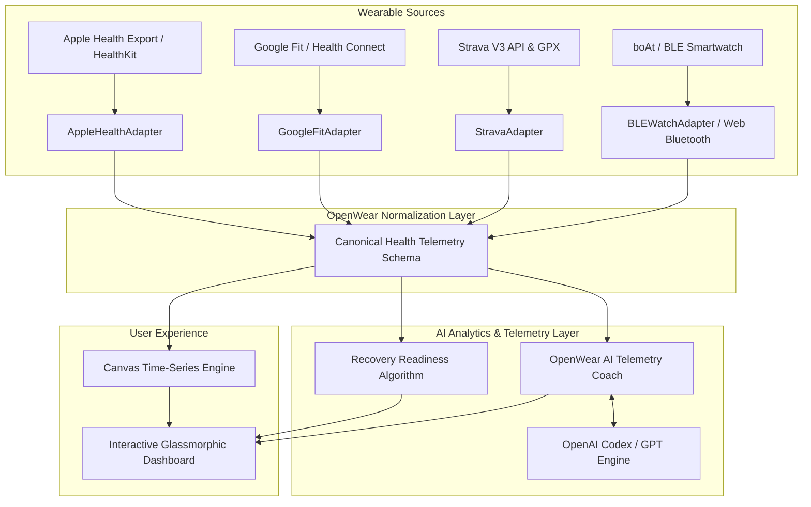

# OpenWear ⚡ — Universal Smartwatch & Health Telemetry Hub

[](https://opensource.org/licenses/MIT)
[](https://vite.dev/)
[](https://openai.com/)
[](https://developer.mozilla.org/en-US/docs/Web/API/Web_Bluetooth_API)

> **Universal open-source biometric telemetry platform and AI health analytics engine connecting Apple Health, Google Fit, Strava, Garmin, and direct BLE smartwatches (boAt, Amazfit, PineTime).**

---

## 🌐 Live Demo & Repository
- **Live Application:** [https://openwear.dev](https://openwear.dev) *(or your deployed Vercel / Netlify URL)*
- **GitHub Repository:** [https://github.com/favazmk/openwear](https://github.com/favazmk/openwear)

---

## 📸 Interface Preview

```
+-----------------------------------------------------------------------------------+
|  ⚡ OpenWear OSS v1.0         [ ⌚ Pair BLE Watch ] [ 🔄 Sync ] [ ⭐ GitHub OSS ]  |
+-----------------------------------------------------------------------------------+
|  [⌚ boAt BLE] [🍎 Apple Health] [⚡ Strava Club] [🟢 Google Fit] [🚤 Wave OS]     |
+-----------------------------------------------------------------------------------+
|  ❤️ HEART RATE        📈 HRV (RMSSD)       🫁 BLOOD OXYGEN      👟 DAILY STEPS     |
|     74 BPM                64 ms                 98 %               9,140 / 10k    |
+-------------------------------------------------+---------------------------------+
|  📊 MULTI-DEVICE TELEMETRY (24h Time-Series)    |  ⚡ PHYSIOLOGICAL RECOVERY       |
|                                                 |      Score: 88/100 (Optimal)     |
|   ~-~-~-~-~-~-~/\_~-~-~-~-~-~-~-~-              |                                 |
|                                                 |  🤖 OPENWEAR AI COACH           |
|  🏃 RECENT WORKOUTS & SYNCED ACTIVITIES         |  "HRV is robust at 64ms. Ready  |
|   • Morning Interval Run (32m, 340 kcal)        |   for high-intensity training." |
|   • Coastal Sunset Ride (75m, 32.5 km)          |  [💬 Ask AI Coach...]           |
+-------------------------------------------------+---------------------------------+
```

---

## 📖 Project Description

Today's consumer wearable landscape is notoriously fragmented into vendor walled-gardens: Apple Health, Google Fit / Health Connect, Strava, and budget smartwatches (boAt, Amazfit, Fire-Boltt, Noise) each isolate biometric data in proprietary formats.

**OpenWear** solves this by delivering an **open-source universal telemetry normalization engine** combined with an **AI-driven biometric analytics coach**. Whether pairing a physical BLE smartwatch directly through browser Web Bluetooth GATT profiles or importing multi-day health streams from Strava and Apple Health, OpenWear converts disparate data into a canonical biometric schema for actionable physiological recovery insights.

---

## 🛠️ Tech Stack

- **Core Engine:** Vanilla ES6+ JavaScript, Modular Adapter Architecture
- **Bundler & Tooling:** [Vite 8](https://vite.dev/) (Sub-second HMR & optimized production tree-shaking)
- **Styling:** Custom Vanilla CSS Design System (Dynamic glassmorphism, responsive grid, tailored HSL color tokens)
- **Device Connectivity:** Native [Web Bluetooth API](https://developer.mozilla.org/en-US/docs/Web/API/Web_Bluetooth_API) (Standard Bluetooth SIG Heart Rate Service `0x180D`, Battery Service `0x180F`)
- **AI Telemetry Engine:** OpenAI Codex / GPT-4o integration bridge with fallback heuristic physiological rule engine
- **Visualization:** Canvas 2D Context high-precision time-series rendering

---

## ⚡ Key Features

- **Universal Multi-Provider Adapters:**
  - 🍎 **Apple Health**: HealthKit XML and JSON stream normalizer.
  - 🟢 **Google Fit & Health Connect**: Standard REST dataset and Android Health Connect permissions mapping.
  - ⚡ **Strava V3**: Ingests activities, GPX track logs, cadence, elevation gain, and pace metrics.
  - 🚤 **boAt Smartwatches**: Specialized BLE telemetry decoder for boAt Wave, Storm, Lunar, and Crest OS watches.
  - ⌚ **Web Bluetooth API**: In-browser zero-driver pairing with any Bluetooth SIG GATT compliant wearable.
- **Canonical Health Telemetry Schema:**
  Standardizes Heart Rate, Resting HR, Heart Rate Variability (RMSSD), Arterial Oxygen Saturation (SpO2), Sleep Stages (Deep, REM, Light, Awake), and metabolic load.
- **Physiological Recovery Score Engine:**
  Calculates autonomic nervous system readiness (0–100) using weighted contributions of nocturnal HRV, sleep architecture, and resting heart rate drift.
- **AI Telemetry Coach & Code Generator:**
  Natural language health analysis powered by OpenAI Codex / GPT models. Automatically generates data science scripts (Python Pandas, SQL) for telemetry data pipelines.
- **Live Stream & Sandbox Mode:**
  Seamless toggle between physical Bluetooth wearable streaming and synthetic sandbox streams for rapid testing and demonstrations.

---

## 🏗️ System Architecture



---

## 🚀 Local Setup & Installation

### Prerequisites
- Node.js 18+ installed on your machine
- Modern web browser (Chrome, Edge, or Opera recommended for Web Bluetooth support)

### 1. Clone the repository
```bash
git clone https://github.com/favazmk/openwear.git
cd openwear
```

### 2. Install dependencies
```bash
npm install
```

### 3. (Optional) Configure OpenAI API Key
To enable live OpenAI Codex telemetry analysis, copy `.env.example` to `.env`:
```bash
cp .env.example .env
```
Add your OpenAI key:
```env
VITE_OPENAI_API_KEY=sk-your-openai-api-key-here
```
*(Note: If no API key is provided, OpenWear seamlessly runs using its built-in heuristic neural rule engine.)*

### 4. Run Development Server
```bash
npm run dev
```
Open your browser at `http://localhost:5173`.

### 5. Build for Production
```bash
npm run build
```

---

## 🤝 Contributing

Contributions are warmly welcomed! Please read our [Contributing Guidelines](CONTRIBUTING.md) and [Code of Conduct](CODE_OF_CONDUCT.md).

---

## 📄 License

This project is licensed under the [MIT License](LICENSE) — free and open for personal, commercial, and research use.
